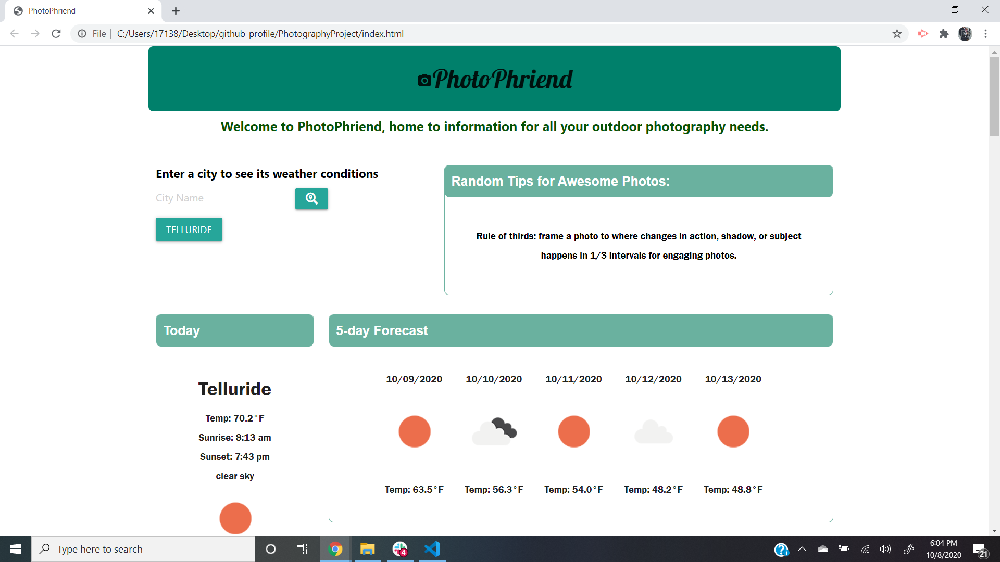
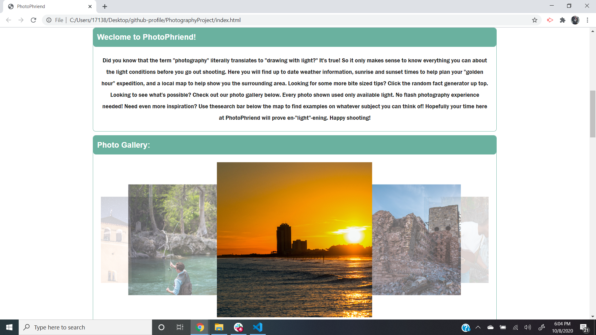
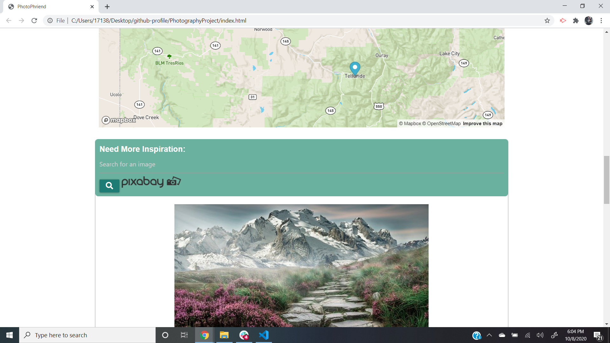

# PhotoPhriend

The direction and amount of light on a given subject is the most important aspect to consider when taking a photo.  For that reason, there is obvious use for a website that gives accurate, up to date information relating to the light conditions at a given location.  PhotoPhriend fulfils this need and further cements itself as a viable photography tool by offering simple tips, examples of nautral light photos, a map of the searched region for people unfamiliar with the locale, and a search function to allow the user to find example photos on any subject of their liking.

## Technology used

PhotoPhriend utilizes HTML, CSS, and javascript while also employing jQuery, Materialize, geolocation integration, and the APIs Openweathermap, Pixabay, and Mapbox.

## Website Layout

## Website
[View PhotoPhriend here](https://ikethe4.github.io/photophriend)

